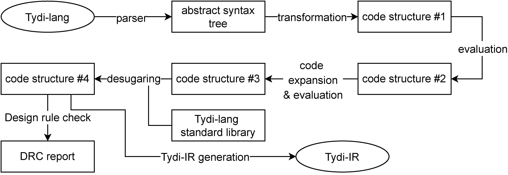
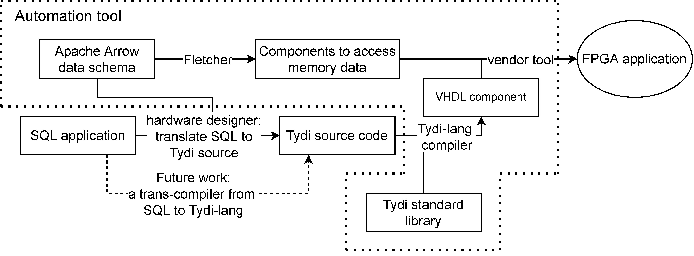

# This project will soon be superseded by [Tydi-lang2](https://github.com/twoentartian/tydi-lang-2), which uses CHISEL as backend to generate synthesizable FPGA code

# Tydi-lang

## what is Tydi-lang?

Tydi-lang is designed to be a FPGA accelerator language, integrating [Tydi-spec](https://ieeexplore.ieee.org/document/9098092) to map complex and dynamiclly sized data structures to hardware streams.

## What is the language syntax?
A short [cheat sheet](./cheat_sheet.md) is available.

Some hello world examples are also available [here](./CookBook)

## What does the Tydi-lang complier do?

## How Tydi-lang helps accelerator designs?
