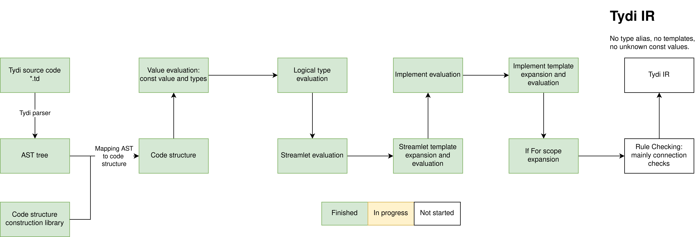

# Known issues
- For the following code: 
```cpp
impl tmux3<n: int, ts: external. impl of sl4<1> > of sl0<n, type stream0> {
  instance test_inst(ts),  test_inst.out => test_inst.in,  process{},
};
```
There must be a space between two ">" followed by an integer, this is due to the limitation of PEST parser. 